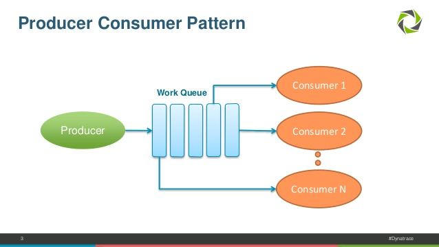

[![Contributors][contributors-shield]][contributors-url]
[![Forks][forks-shield]][forks-url]
[![Stargazers][stars-shield]][stars-url]
[![Issues][issues-shield]][issues-url]
[![MIT License][license-shield]][license-url]
[![LinkedIn][linkedin-shield]][linkedin-url]


<!-- PROJECT LOGO -->
<br />
<p align="center">
  <a href="https://github.com/shie-ld/work-queue">
    
  </a>

  <h3 align="center">Work-Queue</h3>

  <p align="center">
   A solution of the well-known producer-consumer problem using principles of concurrency control and to distribute tasks between threads so they can be processed concurrently keeping critical section in mind.
    <br />
    <br />
    <a href="https://github.com/shie-ld/work-queue/issues">Report Bug</a>
    ·
    <a href="https://github.com/shie-ld/work-queue/issues">Request Feature</a>
  </p>
</p>


<!-- TABLE OF CONTENTS -->
## Table of Contents

* [About the Project](#about-the-project)
  * [Built With](#built-with)
* [Getting Started](#getting-started)
  * [Prerequisites](#prerequisites)
* [Documentation](#documentation)
* [Roadmap](#roadmap)
* [Contributing](#contributing)
* [License](#license)
* [Contact](#contact)


<!-- ABOUT THE PROJECT -->
## About The Project


This project is all about building a multithreaded application to devise a means to distribute tasks between threads so they can be processed concurrently.

Queues are good devices for transferring work items from one thread to another. In this repository I’ll discuss the design of a work queue class implemented in C++ that can be used with [Threads](https://github.com/shie-ld/threads) class objects to easily build a multithreaded application.


### Built With
* [C++](https://www.cplusplus.com/)


<!-- GETTING STARTED -->
## Getting Started

1. Get the source code of [Threads](https://github.com/shie-ld/threads), which is a java like implementation of posix threads encapsulated cleanly in a single C++ class i.e. clone both this repository as well as above repository in the same folder using
```sh
git clone https://github.com/shie-ld/threads.git
git clone https://github.com/shie-ld/work-queue.git
```

2. `cd` to the `threads` directory.
3. Type `make` to build the `threads` program.
4. `cd ..` to jump back to previous directory.
5. `cd` to the `work-queue` directory.
6. Type `make` to build the `work-queue` program.
7. Run the test application as `./wqueue`.


### Prerequisites

1. A C++ compiler, like `g++` or `cc` or `clang`.
2. `make` utility.

Both of them mostly come preinstalled in a typical linux distribution like Ubuntu. 


<!-- DOCUMENTATION -->
## Documentation

See the [docs](./docs/docs.md).

<!-- ROADMAP -->
## Roadmap

See the [open issues](https://github.com/shie-ld/work-queue/issues) for a list of proposed features (and known issues).


<!-- CONTRIBUTING -->
## Contributing

Contributions are what make the open source community such an amazing place to be learn, inspire, and create. Any contributions you make are **greatly appreciated**.

1. Fork the Project
2. Create your Feature Branch (`git checkout -b feature/AmazingFeature`)
3. Commit your Changes (`git commit -m 'Add some AmazingFeature'`)
4. Push to the Branch (`git push origin feature/AmazingFeature`)
5. Open a Pull Request


<!-- LICENSE -->
## License

Distributed under the MIT License. See `LICENSE` for more information.


<!-- CONTACT -->
## Contact

dixitrdreshofficial@gmail.com

Project Link: [https://github.com/shie-ld/work-queue](https://github.com/shie-ld/work-queue)


<!-- MARKDOWN LINKS & IMAGES -->
<!-- https://www.markdownguide.org/basic-syntax/#reference-style-links -->
[contributors-shield]: https://img.shields.io/github/contributors/shie-ld/work-queue.svg?style=flat-square
[contributors-url]: https://github.com/shie-ld/work-queue/graphs/contributors
[forks-shield]: https://img.shields.io/github/forks/shie-ld/work-queue.svg?style=flat-square
[forks-url]: https://github.com/shie-ld/work-queue/network/members
[stars-shield]: https://img.shields.io/github/stars/shie-ld/work-queue.svg?style=flat-square
[stars-url]: https://github.com/shie-ld/work-queue/stargazers
[issues-shield]: https://img.shields.io/github/issues/shie-ld/work-queue.svg?style=flat-square
[issues-url]: https://github.com/shie-ld/work-queue/issues
[license-shield]: https://img.shields.io/github/license/shie-ld/work-queue.svg?style=flat-square
[license-url]: https://github.com/shie-ld/work-queue/blob/master/LICENSE.txt
[linkedin-shield]: https://img.shields.io/badge/-LinkedIn-black.svg?style=flat-square&logo=linkedin&colorB=555
[linkedin-url]: https://linkedin.com/in/rudresh-dixit-11a15618a/

